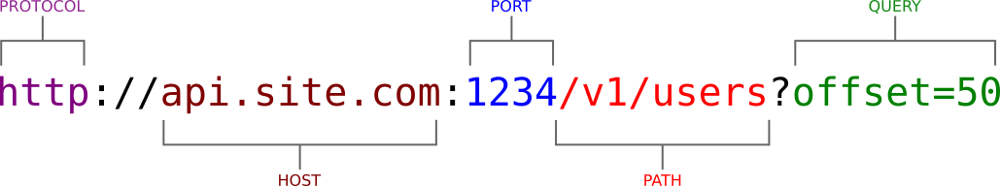

# URL Schema Aplikacie

navrh schemy REST API

* path
* query params
* url

Časť URL adresy označená ako `path` sa zvykne nazývať aj `endpoint` alebo `route`.

## REST API

nase REST API bude pouzivat prefix `/api/v1/`

### Resource `pokemons`

| path                    | method   | meaning                               | type   | status    |
|-------------------------|----------|---------------------------------------|--------|-----------|
| `/api/pokemons/{slug}`  | `GET`    | get pokemon info as JSON document     | detail | `200`        |
| `/api/pokemons/{slug}`  | `DELETE` | delete pokemon with given `slug`      | delete | `200`, `204` |
| `/api/pokemons/{slug}`  | `PUT`    | full update of pokemon with `slug`    | update | `200`  |
| `/api/pokemons/{slug}`  | `PATCH`  | partial update of pokemon with `slug` | update | `200`  |
| `/api/pokemons/`        | `POST`   | create new pokemon                    | create | `201`  |
| `/api/pokemons/`        | `GET`    | return list of pokemons               | list   | `200`  |

### Resource `users`

| path            | method   | meaning                        |
|-----------------|----------|--------------------------------|
| `/users/`       | `GET`    | retrieve list of users         |
| `/users/{slug}` | `GET`    | retrieve info about given user |
| `/users/`       | `POST`   | create new user                |
| `/users/{slug}` | `DELETE` | delete existing user           |
| `/users/me`     | `GET`    | shows my profile               |

### Others

| path            | method | meaning             |
|-----------------|--------|---------------------|
| `/`             | `GET`  | show homepage       |
| `/cron/`        | `GET`  | starts maintainance |
